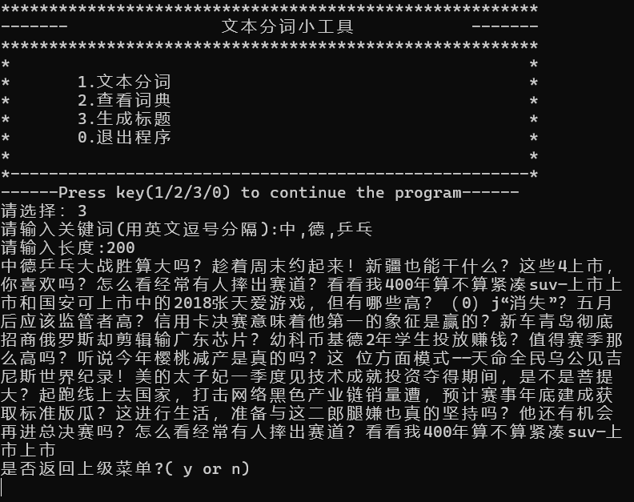
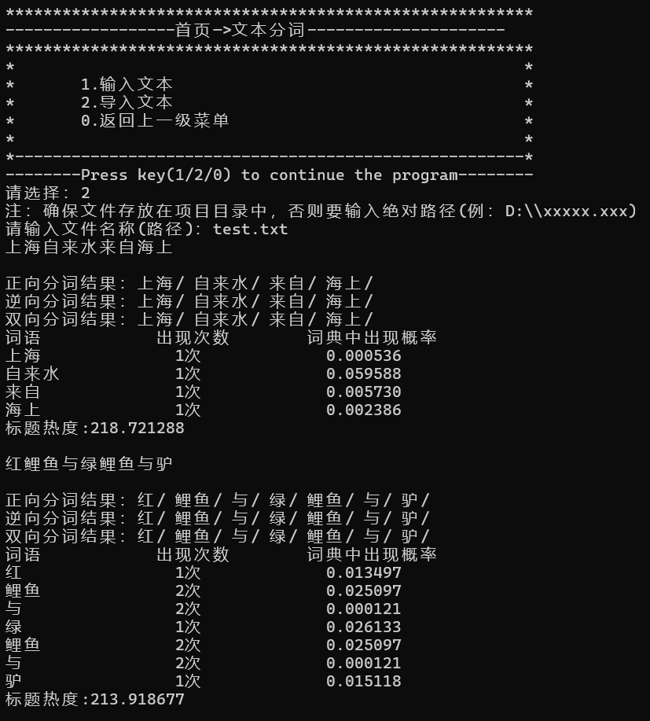

# chomework 简介

这是我大一的程序设计课程设计(C语言)的作业，前端采用C语言编写，用到AI模型的后端则使用python的flask框架编写。主要实现了文本分词，标题热度分析以及标题自动生成的功能。

## 使用方法


### 安装


1，首先安装项目需要的环境，推荐使用`python3.9`

2，接着安装必须的python库：

```
pip install -r requirements.txt
```

3，找到`net.py`文件，直接运行它来启动后端服务

4，双击运行`项目(最终稿).exe`，即可运行该项目，目前只支持`Windows`系统

### 使用


如果对于模型不满意，可以运行`train.py`文件，用来训练新的模型。

如果想要验证模型的效果，可以运行`predict.py`文件，用来使用模型来生成标题。

如果想要批量分词，可以参见`test.txt`文件的格式，在文件后面新增标题。

如果想要更换词典，可以参见`out1.txt`的文件格式，自定义字典内容。

## Demo


### 标题生成



可见模型效果不是很好，有点~~人工智障~~，凑合用吧

### 文本分词



效果还不错！

## 说明


课设项目，有些小bug很正常，凑合用吧。软件工作路径不能为中文或其他非ASCII文本。

喜欢的话可以点一个star！谢谢你的鼓励


## 致谢


本项目使用的数据集来自今日头条中文新闻数据集，感谢其提供的数据

